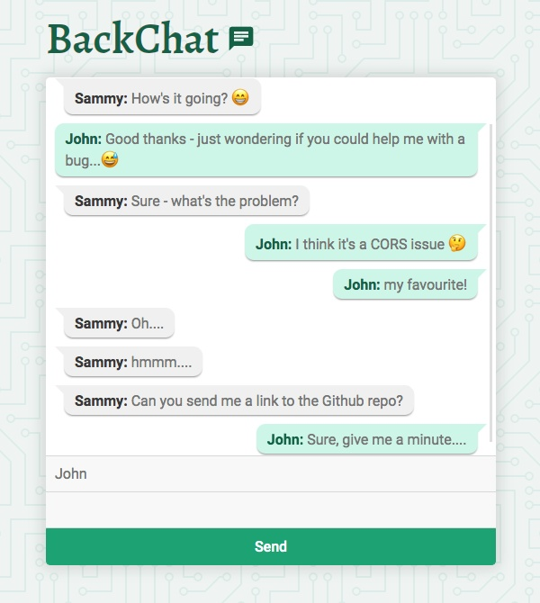

# ChatsApp 💬

A simple, real-time messaging app built with Socket.io, Node and Express.

---

## 🚀 Quick Start

1. **Clone the repository:**
   ```bash
   git clone https://github.com/rolandjlevy/chat-app-with-socket-io.git
   cd chat-app-with-socket-io
   ```
2. **Install dependencies:**
   ```bash
   npm install
   ```
3. **Start the server:**
   ```bash
   npm start
   ```
4. **Open your browser:**
   Visit [http://localhost:3000](http://localhost:3000) in one or more tabs to start chatting!

---

## 🎯 Purpose

This project was created to gain hands-on experience with WebSockets by building a simple, interactive chat application.

## 💡 Features

- Real-time messaging using [WebSocket API](https://developer.mozilla.org/en-US/docs/Web/API/WebSockets_API) and Socket.io
- Emoji dropdown menu (desktop view)
- XSS protection (e.g., blocks ``)
- Fully responsive design

## 🖼️ Screenshot



## 🛠️ Technologies Used

- Node.js, Express, JavaScript, CSS
- [Socket.io](https://socket.io)
- [he HTML entities encoder/decoder](https://github.com/mathiasbynens/he)
- [Emoji library](https://github.com/theraot/emoji)
- [Open Emoji API](https://emoji-api.com/)
- [CSS patterns](http://www.heropatterns.com)

## 📚 References

- Inspired by [NetNinja's WebSockets tutorial](https://www.youtube.com/watch?v=vQjiN8Qgs3c)
- Emoji dropdown: [StackOverflow answer](https://stackoverflow.com/questions/39871916/is-it-possible-to-generate-all-the-emojis-and-append-to-the-select-dropdown)

## 📬 Contact

Created by [Roland](https://rolandlevy.co.uk) — feel free to reach out!
